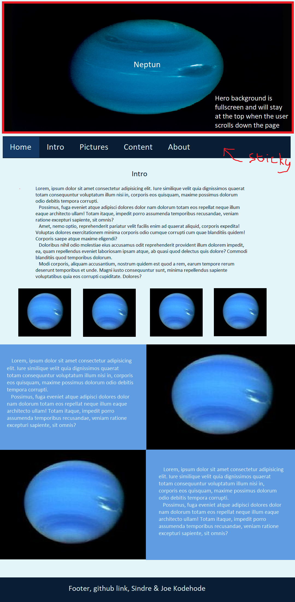

# planeter-prosjekt

## layout
- stort bilete på toppen
- sticky navigasjons bar under bilete
- intro
- hovud innhald
- footer med namn på oss og prosjektet

## notat
- farge-tema: blå, monochrome
- media-queries for responsiv design
- serif font til vanleg tekst

## fargar
- #e1ecf9 (lightest)
- #609ce1 (ligther)
- #236ab9 (normal blue)
- #133863 (darker)
- #091d34 (darkest)

## font
- Hero bilete: [Nova Round](https://fonts.google.com/specimen/Nova+Round)
- Vanleg tekst: [Roboto Serif](https://fonts.google.com/specimen/Roboto+Serif)
- Overskrifter: [Roboto Slab](https://fonts.google.com/specimen/Roboto+Slab)

## oppgåver
- [x] hero bilde (joe)
- [x] navbar, sticky (sindre)
- [x] navbar, dropdown (sindre)
- [x] bilder galleri (sindre)
- [x] finne bileter og text til hovud seksjonen (joe)
- [x] hovud seksjonen (joe)
- [x] footer (joe)

## referansar
- tekst er henta frå Store norske leksikon
- fargar henta frå w3schools
- fontar frå Google Fonts

## mockup

