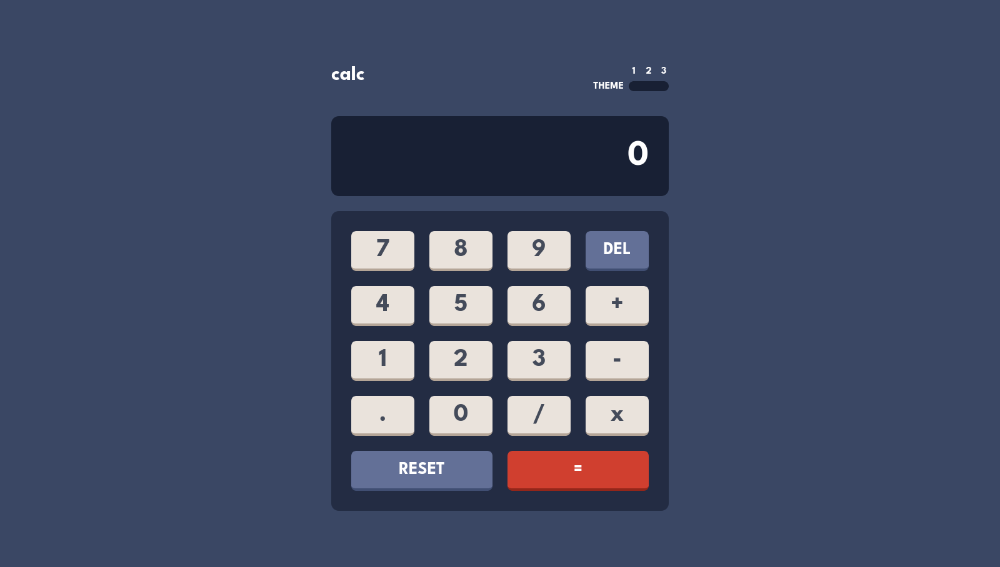
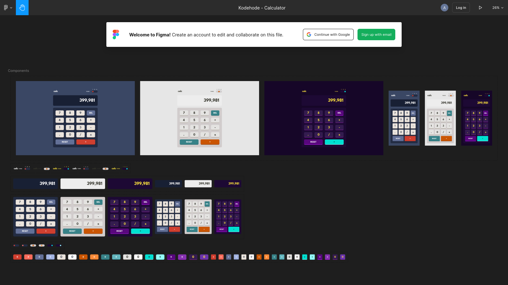

# Task 20: Calculator

**live-site:**
[task-20-ts-react-calculator/dist](https://sindre-kodehode.github.io/task-20-ts-react-calculator/dist/)


**figma-design-file:**
[Kodehode - Calculator](https://www.figma.com/file/cpNH1J9QgcZiW36VaChw0X/Kodehode---Calculator?node-id=0%3A1)


## technology: 
```
Front End Library : React            
State Manager     : Redux Toolkit
CSS in JS         : Styled Components
Static Typing     : Typescript       
Build tool        : Vite             
```

## code-structure:
```
src/
├── App.tsx
├── components/
│   ├── Display/
│   │   ├── index.tsx
│   │   └── style.tsx
│   ├── Header/
│   │   ├── index.tsx
│   │   └── style.tsx
│   ├── Key/
│   │   ├── index.tsx
│   │   ├── style.tsx
│   │   └── types.ts
│   ├── Keypad/
│   │   ├── index.tsx
│   │   └── style.tsx
│   ├── Label/
│   │   ├── index.tsx
│   │   ├── style.tsx
│   │   └── types.ts
│   ├── Radio/
│   │   ├── index.tsx
│   │   └── style.tsx
│   └── ThemeSwitch/
│       ├── index.tsx
│       └── style.tsx
├── constants/
│   └── keys.ts
├── main.tsx
├── store/
│   ├── actions.ts
│   ├── slice.ts
│   └── store.ts
└── theme/
    ├── GlobalStyles.ts
    ├── styled.d.ts
    ├── ThemeContext.tsx
    └── themes.ts
```

## todo:
- theme toggle styling
- correct colors for theme 2 and 3
- add responsive mobile style
- formating of number in display
- add memory and operation text in display
