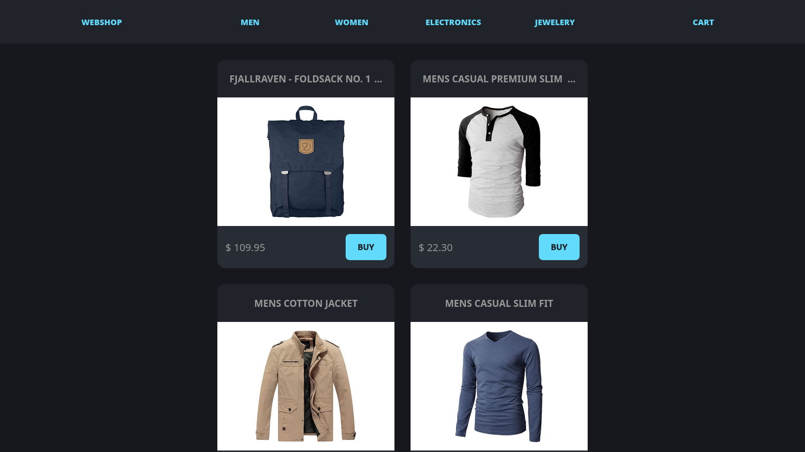
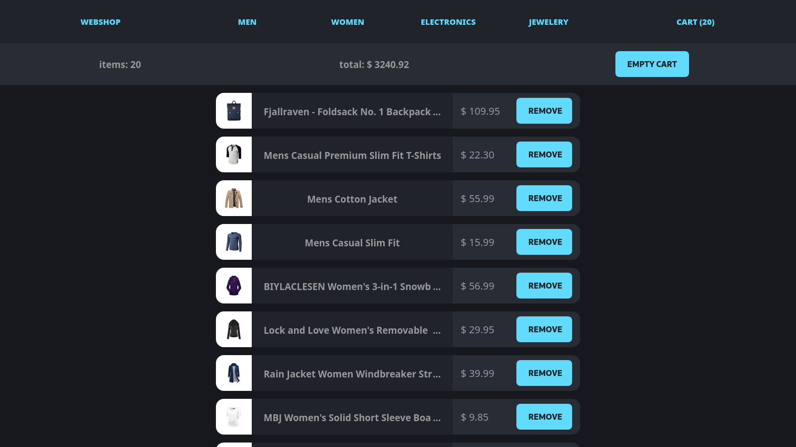

# Task 21: Webshop

**live-site:**
[./task-21-ts-react-webshop/dist](https://sindre-kodehode.github.io/task-21-ts-react-webshop/dist/)

**screenshots:**



## task:

Lag en forenklet nettbutikk med å bruke react.
Det er flere “extra credit” options her, men det må du ikke bruke.
Du skal imidlertidig gjøre følgende (dette er minstekrav).
Husk å tenk at det må være “porteføljeklart” tidligst mulig.
Legg heller til ting etterhvert.

- Bruke redux til å tracke state
- Produktene skal hentes fra denne apien og mappes ut https://fakestoreapi.com/products
- Samle alle tingene man har “kjøpt” i en handlekurv 
- Handlekurven skal ha en egen side hvor man mapper ut produktene man har kjøpt
- Legge til prosjektet på porteføljen din.
- Lag en underside hvor det står alle de forskjellige tingene som brukes
  (redux, api mapping, eventuelt de andre optionals greiene. Anbefaler
  også å ha en lenke som forklarer hva det er for noe. (Mulig at folk
  som ikke kan kode ser på porteføljen din).
- Svar på oppg med å sende inn lenke av porteføljen din.

## technology: 
```
Front End Library : React            
State Manager     : Redux Toolkit
CSS in JS         : Styled Components
Static Typing     : Typescript       
Build tool        : Vite             
```

## code-structure:
```
./task-21-ts-react-webshop/src/
├── App.tsx
├── components/
│   ├── Banner/
│   │   ├── Banner.style.tsx
│   │   ├── Banner.tsx
│   │   ├── Banner.type.ts
│   │   └── index.tsx
│   ├── Button/
│   │   ├── Button.style.tsx
│   │   ├── Button.tsx
│   │   ├── Button.type.ts
│   │   └── index.tsx
│   ├── Cart/
│   │   ├── Cart.style.tsx
│   │   ├── Cart.tsx
│   │   └── index.tsx
│   ├── CartBanner/
│   │   ├── CartBanner.style.tsx
│   │   ├── CartBanner.tsx
│   │   ├── CartBanner.type.ts
│   │   └── index.tsx
│   ├── CartItem/
│   │   ├── CartItem.style.tsx
│   │   ├── CartItem.tsx
│   │   ├── CartItem.type.ts
│   │   └── index.tsx
│   ├── Image/
│   │   ├── Image.style.tsx
│   │   ├── Image.tsx
│   │   ├── Image.type.ts
│   │   └── index.tsx
│   ├── Link/
│   │   ├── index.tsx
│   │   ├── Link.style.tsx
│   │   └── Link.tsx
│   ├── Navbar/
│   │   ├── index.tsx
│   │   ├── Navbar.style.tsx
│   │   └── Navbar.tsx
│   ├── Price/
│   │   ├── index.tsx
│   │   ├── Price.style.tsx
│   │   ├── Price.tsx
│   │   └── Price.type.ts
│   ├── Product/
│   │   ├── index.tsx
│   │   ├── Product.style.tsx
│   │   ├── Product.tsx
│   │   └── Product.type.ts
│   ├── Products/
│   │   ├── index.tsx
│   │   ├── Products.style.tsx
│   │   ├── Products.tsx
│   │   └── Products.type.ts
│   └── Title/
│       ├── index.tsx
│       ├── Title.style.tsx
│       ├── Title.tsx
│       └── Title.type.ts
├── const/
│   ├── categories.ts
│   └── prducts.json
├── hooks/
│   ├── useFetch.ts
│   └── useFetch.type.ts
├── main.tsx
├── store/
│   ├── cartSlice.ts
│   └── store.ts
├── theme/
│   └── GlobalStyles.ts
└── type/
    └── product.type.ts
```

## todo:

- Add an info page for each individual item
- Show amount of each item added to cart
